# Planned finished SABRhood site

The public site is organized around daily discovery, deep research, interactive
analysis, and broadcaster products. Private production tools feed compact,
reviewable outputs into those public surfaces.

```mermaid
flowchart TD
  Home[Home / latest intelligence] --> Today[Today / signal desk]
  Home --> StoryDesk[Story Engine / assignment queue]
  Home --> Races[League races]
  Home --> Research[Research stories]
  Home --> Newsletter[Daily newsletter]
  Home --> Projections[Daily simulation center]
  Today --> Players[Player intelligence]
  Players --> ChangeEngine[Player Change Engine / z-scores plus percentiles]
  Today --> Teams[Team intelligence]
  Today --> History[History and milestones]
  Today --> Matchups[Matchup edges]
  Players --> PitchLab[Pitch and sequence lab]
  Matchups --> PitchLab
  PitchLab --> AAA[Triple-A Watch / age and performance radar]
  Teams --> TeamPages[Thirty team dossiers]
  TeamPages --> BroadcastThree[Broadcast Three / on-air notes]
  Races --> Forecasts[Projections and simulations]
  Forecasts --> Decisions[Manager and bullpen decisions]
  Research --> StoryPages[Articles and visual spotlights]
  Newsletter --> Archive[Newsletter archive]
  Home --> Broadcast[Broadcast services]
  Broadcast --> PacketLibrary[Public packet portfolio]
  Broadcast --> PacketStudio[Private packet studio]
  PacketStudio --> HTML[Offline HTML packet]
  PacketStudio --> PDF[PDF packet]
  Home --> AnalyticsLab[Private analytics lab]
  AnalyticsLab --> PlayerSearch[Player and team search]
  AnalyticsLab --> ChartBuilder[Chart and spotlight builder]
  AnalyticsLab --> Downloads[Images, tables, and research exports]
  Data[Automated MLB data pipeline] --> LiveInputs[Schedule / starters / orders / active rosters / weather]
  LiveInputs --> Today
  LiveInputs --> Forecasts
  Data --> AAA
  Data --> Awards[FanGraphs award performance room]
  Awards --> Graphics[Downloadable graphics feed]
  Graphics --> Newsletter
  Data --> Newsletter
  Data --> Forecasts
  Data --> PacketStudio
  Data --> AnalyticsLab
```

## Product boundaries

- Public editorial: home, Today, races, players, Player Change Engine, teams, history, Pitch Lab, Triple-A Watch,
  Matchup Edges, Story Engine, daily simulation center, newsletter, research, and selected
  packet examples.
- Private production: analytics lab, packet studio, editorial queue, and data
  quality controls.
- Reusable engine: `sabrhoodR`, derived-data jobs, simulations, historical
  context, manager models, and automated publishing workflows.
