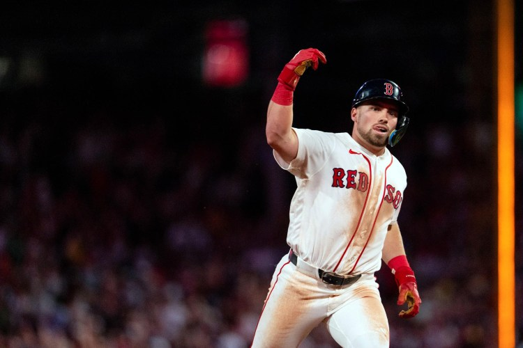
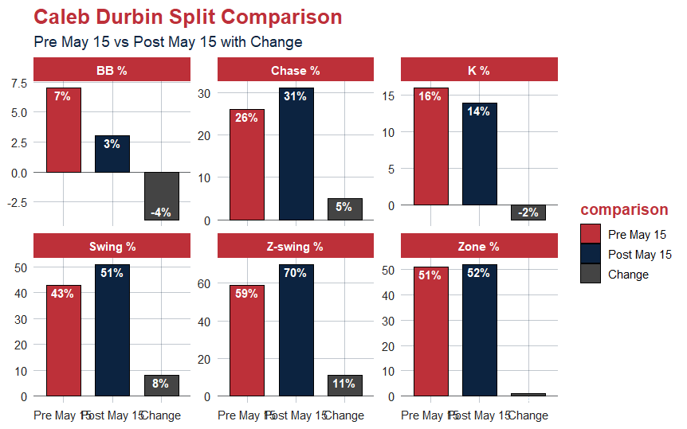
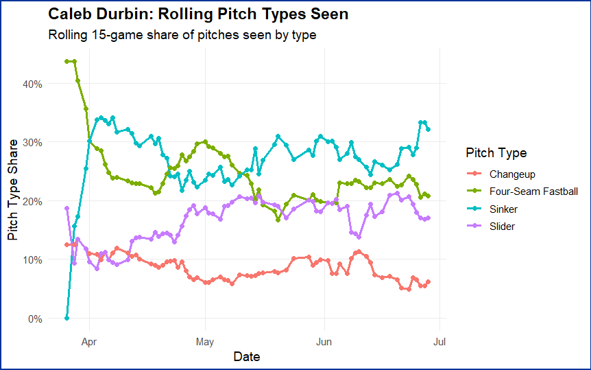

```{r}
#| echo: false
#| warning: false
#| message: false

library(tidyverse)
library(here)
library(kableExtra)
library(baseballr)

#source(here("R", "my methods.R"))
```

:::: {.article-shell .theme-red-sox}
[Red Sox Analysis]{.article-kicker}

<p class="article-deck">

Caleb Durbin started his time in Boston with a less than medicore run at the plate. Now he has changed his approach and given the Red Sox lineup a spark it so desparately needed. How has Durbin changed his approach?

</p>

::: article-callout
*"Whoever is first in the field and awaits the coming of the enemy, will be fresh for the fight." - Sun Tzu*
:::

## Durbin Gets a Lift

Caleb Durbin entered the season on a miserable run, which corresponded with the rest of the Red Sox offense. On May 15th, the new Red Sox third-baseman held the league’s second worst SLG of any qualified hitter(.250), only ahead of Nasim Nuñez of the Nationals. As for team production, the Red Sox had the second fewest runs scored in the American League(163), only holding one more run scored than the Texas Rangers.

Early in his campaign, Durbin was not able to create enough proper contact to even hold a batting average of .200. His ground ball rate was at 59%, which was 96th percentile in MLB. Without any lift to the ball there is no chance for damage to be inflicted. The most valuable types of contact are in the air since they automatically get through the infield and have the chance to end up over the fence. So a colossal GB% will lead to minimum production, especially with a well below average hard hit rate(30%, 20th percentile).

Then his season began to see a turnaround come the flip of the calendar to June. His OPS in the month is at .940, a jump of .400 points from his May OPS. The reason for this leap in production? He became the aggressor v. the pitcher rather than the responder. In the first half of his season, Durbin was taking pitches in the zone 59% of the time(14th percentile). Let me remind you that in that time frame he was the second worst qualified hitter by SLG(.250). After May 15th, he changed his approach by pulling the trigger on 70% of pitches in the zone(69th percentile). He now takes his plate appearances on his own terms. These extra swings he takes and the contact he makes on these swings has resulted in a change of his batted ball quality. Since his change in approach, he has a BELOW AVERAGE GB% after starting the year in the 96th percentile by dropping his GB5 by 18 percent(41%).



The extra lift and subsequent damage he has been able to generate has not come easy. Durbin has been able to double his average launch angle in spite of facing the highest volume of sinkers in the league. It is impressive how he has worked to raise his launch angle and lower his GB% to the league averages while also being pumped with sinkers from pitchers all year.

I expect pitchers to continue to attack Caleb Durbin with sinkers, especially since there has been another uptick in sinkers offered to him in the past few days; most likely in response to the tear he has been on.


::::
